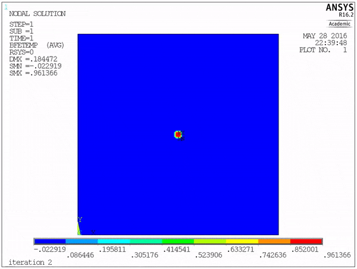

# Introduction
Here, I demonstrate a simple implementation of a phase field model into ANSYS using the macro. This approach is not computationally efficient but it does the job and the implementation is very simple. For simplicity, the phase field model here operates only with one order parameter and the transformation strain is modelled through the thermal coefficients. 

*Growth of a single martensitic variant in an austenitic matrix*

## Phase Field Model
The program minimizes the following energy functional:

withing the Ginzburg-Landau theory:

where,  are double well potential constants,  is the order parameter,  is the gradient coefficient,  are strain tensors (total strain and transformation strain), and  is the tensor of elastic constants.  is a mobility constant. 

I have chosen the following double well potential:

These equations are solved together with the equations of mechanical equilibrium at each time step:

## Implementation into ANSYS using APDL macro

In this implementation I model the transformation strain through the secant coefficients (represents the transformation strain) and temperature (represents the order parameter). 

## Solution
### Clamped Boundaries
With clamped boundary conditions the system equilibrates with the following pattern formation:

Not all austenite can transform. However, for stress free boundary conditions, eventually all austenite would transform as there would be no constraints on the boundaries of the system.

### Loading with a constant strain rate (stress-strain curve)

